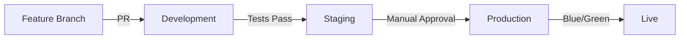

# 🚀 AWS Servicios Esenciales y CI/CD para ChambaPE

## 📋 Resumen Ejecutivo

Este documento presenta un análisis completo de los servicios AWS esenciales para el despliegue de ChambaPE en producción, junto con recomendaciones para automatización CI/CD que permitan múltiples deploys eficientes.

**Estado actual**: El proyecto ya cuenta con una arquitectura AWS sólida que incluye:
- ✅ Configuración Docker optimizada para AWS
- ✅ Scripts de despliegue automatizado (`deploy-aws.sh`)
- ✅ Integración con S3 para almacenamiento de archivos
- ✅ Configuración para múltiples servicios AWS (RDS, ElastiCache, SES, etc.)
- ✅ Validación de trabajadores con Lambda functions

---

## 🏗️ Stack Mínimo Viable para Producción

### 1. **Servicios Computacionales**

#### **Amazon ECS Fargate** (Principal) ⭐
- **Uso**: Orquestación de contenedores sin servidor
- **Beneficios**: 
  - Escalado automático sin gestión de servidores
  - Pago por uso (CPU/memoria consumida)
  - Integración nativa con ALB y CloudWatch
- **Configuración mínima**: 
  - 1 cluster ECS
  - Task definition con 0.5 vCPU, 1GB RAM (escalable)
  - Auto Scaling configurado (min: 1, max: 10 tasks)

#### **AWS Lambda** (Complementario)
- **Uso**: Validación de trabajadores (RENIEC, SUNAT, verificación de documentos)
- **Funciones actuales**: `validate-reniec`, `validate-sunat`, `validate-background`
- **Beneficios**: Costo ultra-bajo para operaciones puntuales

### 2. **Base de Datos**

#### **Amazon RDS PostgreSQL** ⭐
- **Configuración recomendada**:
  - Instancia: `db.t3.micro` (inicio) → `db.t3.small` (producción)
  - Multi-AZ: Sí (alta disponibilidad)
  - Automated backups: 7 días
  - Performance Insights: Habilitado
- **Estimación de costo**: $20-40/mes (micro), $50-80/mes (small)

#### **Amazon ElastiCache Redis** (Opcional pero recomendado)
- **Uso**: Cache de sesiones, rate limiting, cache de consultas
- **Configuración**: `cache.t3.micro` (1 nodo)
- **Estimación de costo**: $15-25/mes

### 3. **Almacenamiento**

#### **Amazon S3** ⭐
- **Buckets necesarios**:
  - `chambape-uploads-prod`: Archivos de usuarios
  - `chambape-worker-certificates`: Certificados de trabajadores
  - `chambape-backups`: Respaldos de BD
- **Configuraciones**:
  - Versioning habilitado
  - Lifecycle policies (archivos > 90 días → IA, > 365 días → Glacier)
  - Server-side encryption (AES-256)

### 4. **Red y Balanceado**

#### **Application Load Balancer (ALB)** ⭐
- **Función**: Distribución de tráfico, terminación SSL, health checks
- **Configuración**:
  - Listeners: HTTP (redirige a HTTPS) y HTTPS
  - Target Groups: ECS tasks
  - Health check: `/health` endpoint

#### **Amazon VPC**
- **Configuración**:
  - 2 AZ mínimo (alta disponibilidad)
  - Subnets públicas (ALB) y privadas (ECS, RDS)
  - NAT Gateway para acceso a internet desde subnets privadas

### 5. **Seguridad y Certificados**

#### **AWS Certificate Manager (ACM)** ⭐
- **Uso**: Certificados SSL/TLS gratuitos
- **Dominios**: `api.chambape.com`, `*.chambape.com`

#### **AWS Secrets Manager** ⭐
- **Secretos almacenados**:
  - Credenciales de base de datos
  - JWT secrets
  - API keys externos (RENIEC, SUNAT)
  - Claves OAuth (Google, Facebook)

#### **AWS WAF** (Recomendado)
- **Protección**: DDoS, inyección SQL, XSS
- **Reglas**: Rate limiting, geoblocking, whitelisting

### 6. **Monitoreo y Logs**

#### **Amazon CloudWatch** ⭐
- **Métricas**: CPU, memoria, requests/sec, response time
- **Logs**: Aplicación, ECS, ALB
- **Alarmas**: CPU > 80%, Error rate > 5%, Response time > 2s

#### **AWS X-Ray** (Opcional)
- **Uso**: Tracing distribuido y análisis de performance

---

## 💰 Estimación de Costos Mensuales

### **Configuración Inicial (MVP)**
| Servicio | Configuración | Costo estimado |
|----------|---------------|----------------|
| ECS Fargate | 0.5 vCPU, 1GB RAM, 2 tasks | $25-35 |
| RDS PostgreSQL | db.t3.micro, Multi-AZ | $30-40 |
| ALB | Standard | $20-25 |
| S3 | 10GB storage, 1000 requests | $5-10 |
| CloudWatch | Logs + métricas | $10-15 |
| Secrets Manager | 5 secretos | $2-3 |
| ACM | Certificados SSL | $0 |
| **TOTAL INICIAL** | | **$92-128/mes** |

### **Configuración Escalada (Producción Media)**
| Servicio | Configuración | Costo estimado |
|----------|---------------|----------------|
| ECS Fargate | 1 vCPU, 2GB RAM, 4 tasks | $80-100 |
| RDS PostgreSQL | db.t3.small, Multi-AZ | $60-80 |
| ElastiCache Redis | cache.t3.micro | $20-25 |
| ALB | Con WAF | $35-40 |
| S3 | 100GB storage, 10K requests | $25-30 |
| Lambda | 1M invocaciones/mes | $5-10 |
| CloudWatch | Extended monitoring | $20-25 |
| **TOTAL ESCALADO** | | **$245-310/mes** |

---

## 🔄 Estrategias de CI/CD Recomendadas

### **Opción 1: GitHub Actions** (Recomendado) ⭐

#### **Ventajas**:
- ✅ Integración nativa con GitHub
- ✅ Costo bajo (2000 minutos gratis/mes)
- ✅ Configuración simple
- ✅ Amplio ecosistema de actions

#### **Configuración propuesta**:

```yaml
# .github/workflows/deploy-production.yml
name: Deploy to Production

on:
  push:
    branches: [ main ]
  pull_request:
    branches: [ main ]

env:
  AWS_REGION: us-east-1
  ECR_REPOSITORY: chambape-api
  ECS_SERVICE: chambape-api-service
  ECS_CLUSTER: chambape-cluster

jobs:
  test:
    runs-on: ubuntu-latest
    steps:
      - uses: actions/checkout@v3
      - uses: actions/setup-node@v3
        with:
          node-version: 18
          cache: 'npm'
      - run: npm ci
      - run: npm run test
      - run: npm run test:e2e

  build-and-deploy:
    needs: test
    runs-on: ubuntu-latest
    if: github.ref == 'refs/heads/main'
    
    steps:
      - name: Checkout
        uses: actions/checkout@v3

      - name: Configure AWS credentials
        uses: aws-actions/configure-aws-credentials@v2
        with:
          aws-access-key-id: ${{ secrets.AWS_ACCESS_KEY_ID }}
          aws-secret-access-key: ${{ secrets.AWS_SECRET_ACCESS_KEY }}
          aws-region: ${{ env.AWS_REGION }}

      - name: Login to Amazon ECR
        id: login-ecr
        uses: aws-actions/amazon-ecr-login@v1

      - name: Build, tag, and push image to Amazon ECR
        id: build-image
        env:
          ECR_REGISTRY: ${{ steps.login-ecr.outputs.registry }}
          IMAGE_TAG: ${{ github.sha }}
        run: |
          docker build -f Dockerfile.aws -t $ECR_REGISTRY/$ECR_REPOSITORY:$IMAGE_TAG .
          docker push $ECR_REGISTRY/$ECR_REPOSITORY:$IMAGE_TAG
          echo "image=$ECR_REGISTRY/$ECR_REPOSITORY:$IMAGE_TAG" >> $GITHUB_OUTPUT

      - name: Deploy to Amazon ECS
        uses: aws-actions/amazon-ecs-deploy-task-definition@v1
        with:
          task-definition: task-definition.json
          service: ${{ env.ECS_SERVICE }}
          cluster: ${{ env.ECS_CLUSTER }}
          wait-for-service-stability: true

  deploy-lambdas:
    needs: test
    runs-on: ubuntu-latest
    if: github.ref == 'refs/heads/main'
    
    steps:
      - uses: actions/checkout@v3
      - name: Deploy Lambda functions
        run: |
          cd lambda-functions
          for func in validate-reniec validate-sunat validate-background; do
            cd $func
            zip -r ../lambda-$func.zip .
            aws lambda update-function-code \
              --function-name chambape-$func \
              --zip-file fileb://lambda-$func.zip
            cd ..
          done

  notify:
    needs: [build-and-deploy, deploy-lambdas]
    runs-on: ubuntu-latest
    if: always()
    steps:
      - name: Notify deployment status
        run: |
          if [ "${{ needs.build-and-deploy.result }}" == "success" ]; then
            echo "✅ Deployment successful!"
          else
            echo "❌ Deployment failed!"
          fi
```

#### **Workflows adicionales**:

1. **Staging Deployment** (`.github/workflows/deploy-staging.yml`)
2. **Database Migrations** (`.github/workflows/run-migrations.yml`)
3. **Security Scans** (`.github/workflows/security-scan.yml`)

### **Opción 2: AWS CodePipeline** (Alternativa empresarial)

#### **Ventajas**:
- ✅ Integración completa con AWS
- ✅ IAM roles granulares
- ✅ CloudWatch monitoring nativo
- ✅ Aprobaciones manuales para producción

#### **Configuración**:
- **Source**: GitHub webhook
- **Build**: CodeBuild (Docker + tests)
- **Deploy**: CodeDeploy Blue/Green para ECS

### **Opción 3: GitLab CI/CD** (Si se migra a GitLab)

#### **Ventajas**:
- ✅ GitLab Pages para documentación
- ✅ Container Registry incluido
- ✅ Review Apps automáticas

---

## 🚀 Estrategia de Múltiples Deploys

### **Ambientes Recomendados**:

1. **Development** (`dev.chambape.com`)
   - 1 task ECS Fargate (mínimo)
   - RDS t3.micro
   - Deploy automático en cada push a `develop`

2. **Staging** (`staging.chambape.com`)
   - 2 tasks ECS Fargate
   - RDS t3.small
   - Deploy automático en cada PR a `main`
   - Tests E2E completos

3. **Production** (`api.chambape.com`)
   - 3+ tasks ECS Fargate con auto-scaling
   - RDS t3.medium con Multi-AZ
   - Deploy manual con aprobación
   - Blue/Green deployment

### **Branching Strategy**:
```
main (production)
├── develop (development)
├── staging (staging)
└── feature/* (feature branches)
```

### **Deploy Pipeline**:


---

## 🔐 Configuración de Seguridad

### **IAM Roles y Políticas**:

1. **ECS Task Role**:
   - S3 access para uploads
   - Secrets Manager read access
   - CloudWatch logs write

2. **Lambda Execution Role**:
   - VPC access (si necesario)
   - Secrets Manager read
   - S3 read/write para certificados

3. **CI/CD User**:
   - ECR push/pull
   - ECS deploy
   - Lambda update

### **Network Security**:
- Security Groups restrictivos
- VPC Flow Logs habilitados
- WAF con reglas anti-bot
- Rate limiting en ALB

---

## 📊 Monitoreo y Alertas

### **Métricas Clave**:
- **Performance**: Response time, throughput, error rate
- **Infrastructure**: CPU, memoria, conexiones DB
- **Business**: Registros/día, trabajos completados, pagos procesados

### **Alertas Críticas**:
- Error rate > 5% (15 min)
- Response time > 2s (5 min)
- CPU > 80% (10 min)
- DB connections > 80% (5 min)
- Disk space < 20% (inmediato)

### **Dashboard de Monitoreo**:
```json
{
  "widgets": [
    {
      "type": "metric",
      "properties": {
        "metrics": [
          ["AWS/ECS", "CPUUtilization", "ServiceName", "chambape-api-service"],
          ["AWS/ECS", "MemoryUtilization", "ServiceName", "chambape-api-service"],
          ["AWS/ApplicationELB", "TargetResponseTime", "LoadBalancer", "chambape-alb"]
        ],
        "period": 300,
        "stat": "Average",
        "region": "us-east-1",
        "title": "Infrastructure Metrics"
      }
    }
  ]
}
```

---

## 🔄 Backup y Disaster Recovery

### **Estrategia de Backups**:

1. **Base de Datos**:
   - Automated backups (7 días)
   - Manual snapshots antes de deploys
   - Cross-region replication (opcional)

2. **Archivos S3**:
   - Versioning habilitado
   - Cross-region replication
   - Lifecycle policies para optimizar costos

3. **Configuración**:
   - Infrastructure as Code (Terraform)
   - Secrets en AWS Secrets Manager
   - Container images en ECR

### **Recovery Time Objectives (RTO)**:
- **Database**: < 15 minutos (Multi-AZ)
- **Application**: < 5 minutos (ECS auto-healing)
- **Complete DR**: < 30 minutos (cross-region)

---

## 📈 Plan de Escalamiento

### **Métricas de Escalamiento**:
- **CPU > 70%**: Escalar ECS tasks
- **Memory > 80%**: Escalar ECS tasks
- **DB connections > 70%**: Escalar RDS
- **Request queue > 100**: Escalar tasks

### **Escalamiento Automático ECS**:
```json
{
  "scalingPolicy": {
    "targetValue": 70.0,
    "scaleOutCooldown": 300,
    "scaleInCooldown": 300,
    "metric": "CPUUtilization"
  },
  "minCapacity": 2,
  "maxCapacity": 20
}
```

---

## 🎯 Roadmap de Implementación

### **Fase 1: MVP (Semana 1-2)**
- [ ] Configurar ECR y subir imagen inicial
- [ ] Crear cluster ECS con task definition básica
- [ ] Configurar RDS PostgreSQL
- [ ] Setup ALB con certificado SSL
- [ ] Configurar GitHub Actions básico

### **Fase 2: Producción Básica (Semana 3-4)**
- [ ] Implementar monitoring con CloudWatch
- [ ] Configurar Secrets Manager
- [ ] Setup WAF básico
- [ ] Implementar backup automático
- [ ] Deploy de Lambda functions

### **Fase 3: Optimización (Mes 2)**
- [ ] Auto-scaling completo
- [ ] Múltiples ambientes (dev/staging/prod)
- [ ] Blue/Green deployments
- [ ] Monitoring avanzado con alertas

### **Fase 4: Escalamiento (Mes 3+)**
- [ ] CDN con CloudFront
- [ ] ElastiSearch para logs
- [ ] Cross-region deployment
- [ ] Advanced security scanning

---

## 🚨 Consideraciones Importantes

### **Costos Variables**:
- El tráfico puede aumentar costos de ALB y data transfer
- Lambda costs dependen del volumen de validaciones
- S3 costs crecen con el storage de archivos

### **Compliance y Regulaciones**:
- GDPR/CCPA: Configurar data retention policies
- PCI DSS: Si se procesan pagos (usar AWS Payment Cryptography)
- Auditoría: CloudTrail habilitado

### **Performance Considerations**:
- CDN para assets estáticos (CloudFront)
- Connection pooling para la base de datos
- Cache warming strategies
- Database query optimization

---

## 📞 Próximos Pasos Recomendados

1. **Inmediato (Esta semana)**:
   - Revisar y actualizar secrets en Secrets Manager
   - Configurar GitHub secrets para CI/CD
   - Ejecutar el script de deploy inicial en staging

2. **Corto plazo (Próximas 2 semanas)**:
   - Implementar el pipeline de GitHub Actions
   - Configurar monitoring y alertas básicas
   - Setup de ambientes múltiples

3. **Mediano plazo (Próximo mes)**:
   - Optimizar costos con reserved instances
   - Implementar WAF y security hardening
   - Setup de disaster recovery

4. **Largo plazo (Próximos 3 meses)**:
   - Evaluar migración a Kubernetes (EKS) si el crecimiento lo justifica
   - Implementar microservicios adicionales
   - Setup de multi-region deployment

---

## 📋 Checklist Final

### **Pre-Deploy**:
- [ ] AWS CLI configurado con permisos correctos
- [ ] Secrets configurados en Secrets Manager
- [ ] Dominio registrado y DNS configurado
- [ ] SSL certificate solicitado y validado

### **Deploy Day**:
- [ ] Backup de datos actual (si aplica)
- [ ] Execute deploy script
- [ ] Verificar health checks
- [ ] Test de conectividad desde Flutter app
- [ ] Verificar logging y monitoring

### **Post-Deploy**:
- [ ] Configurar alertas de monitoreo
- [ ] Documentar access keys y endpoints
- [ ] Setup de backup automático
- [ ] Test de disaster recovery

---

**¡Tu infraestructura ChambaPE está lista para escalamiento empresarial! 🚀**

*Para cualquier consulta técnica o ajustes específicos, el script `deploy-aws.sh` ya incluye la mayoría de estas configuraciones y puede ser customizado según necesidades específicas.*
