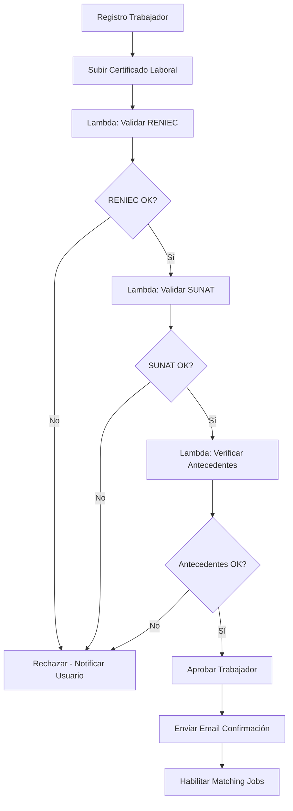

# 🚀 AWS Migration Plan - ChambaPE Backend

## 📋 Arquitectura para Validación de Trabajadores (NUEVA FUNCIONALIDAD)

### **Flujo de Validación RENIEC/SUNAT/Certificado Único Laboral**

La nueva lógica de validación se implementará usando:

- **AWS Lambda** - Validaciones asíncronas de RENIEC/SUNAT
- **Step Functions** - Orquestación del flujo de validación
- **SQS** - Cola de procesamiento para validaciones
- **Secrets Manager** - Almacenamiento seguro de API keys
- **S3** - Almacenamiento de certificados laborales

### **Flujo de Trabajo Propuesto:**



### **Estimación de Costos Adicionales por Validación:**
- Lambda executions: ~$15-25/mes (1000 validaciones)
- Step Functions: ~$5-10/mes
- SQS: ~$2-5/mes
- Secrets Manager: ~$2/mes
- S3 storage (certificados): ~$3-8/mes

## Phase 1: Core Infrastructure

### 1. VPC & Networking Setup
```terraform
# vpc.tf
resource "aws_vpc" "chambape_vpc" {
  cidr_block           = "10.0.0.0/16"
  enable_dns_hostnames = true
  enable_dns_support   = true
  
  tags = {
    Name = "ChambaPE-VPC"
    Environment = "production"
  }
}

resource "aws_subnet" "private_subnets" {
  count             = 2
  vpc_id            = aws_vpc.chambape_vpc.id
  cidr_block        = "10.0.${count.index + 1}.0/24"
  availability_zone = data.aws_availability_zones.available.names[count.index]
  
  tags = {
    Name = "ChambaPE-Private-${count.index + 1}"
  }
}

resource "aws_subnet" "public_subnets" {
  count                   = 2
  vpc_id                  = aws_vpc.chambape_vpc.id
  cidr_block              = "10.0.${count.index + 10}.0/24"
  availability_zone       = data.aws_availability_zones.available.names[count.index]
  map_public_ip_on_launch = true
  
  tags = {
    Name = "ChambaPE-Public-${count.index + 1}"
  }
}
```

### 2. RDS PostgreSQL Setup
```terraform
# rds.tf
resource "aws_db_instance" "chambape_db" {
  allocated_storage      = 100
  max_allocated_storage  = 1000
  storage_type           = "gp3"
  engine                 = "postgres"
  engine_version         = "15.4"
  instance_class         = "db.t3.medium"
  db_name                = "chambape_prod"
  username               = "chambape_admin"
  password               = var.db_password
  
  vpc_security_group_ids = [aws_security_group.rds_sg.id]
  db_subnet_group_name   = aws_db_subnet_group.chambape_db_subnet.name
  
  backup_retention_period = 7
  backup_window          = "03:00-04:00"
  maintenance_window     = "sun:04:00-sun:05:00"
  
  multi_az               = true
  publicly_accessible    = false
  storage_encrypted      = true
  
  skip_final_snapshot = false
  final_snapshot_identifier = "chambape-final-snapshot-${formatdate("YYYY-MM-DD-hhmm", timestamp())}"
  
  tags = {
    Name = "ChambaPE-Production-DB"
    Environment = "production"
  }
}
```

### 3. ElastiCache Redis
```terraform
# redis.tf
resource "aws_elasticache_subnet_group" "chambape_redis_subnet" {
  name       = "chambape-redis-subnet"
  subnet_ids = aws_subnet.private_subnets[*].id
}

resource "aws_elasticache_cluster" "chambape_redis" {
  cluster_id           = "chambape-redis"
  engine               = "redis"
  node_type            = "cache.t3.micro"
  num_cache_nodes      = 1
  parameter_group_name = "default.redis7"
  port                 = 6379
  subnet_group_name    = aws_elasticache_subnet_group.chambape_redis_subnet.name
  security_group_ids   = [aws_security_group.redis_sg.id]
  
  tags = {
    Name = "ChambaPE-Redis"
    Environment = "production"
  }
}
```

## Phase 2: Application Deployment

### 1. ECS Fargate Cluster
```terraform
# ecs.tf
resource "aws_ecs_cluster" "chambape_cluster" {
  name = "ChambaPE-Cluster"
  
  configuration {
    execute_command_configuration {
      logging = "OVERRIDE"
      
      log_configuration {
        cloud_watch_encryption_enabled = true
        cloud_watch_log_group_name     = aws_cloudwatch_log_group.ecs_logs.name
      }
    }
  }
  
  tags = {
    Name = "ChambaPE-ECS-Cluster"
    Environment = "production"
  }
}

resource "aws_ecs_task_definition" "chambape_app" {
  family                   = "chambape-api"
  network_mode             = "awsvpc"
  requires_compatibilities = ["FARGATE"]
  cpu                      = 1024
  memory                   = 2048
  execution_role_arn       = aws_iam_role.ecs_execution_role.arn
  task_role_arn           = aws_iam_role.ecs_task_role.arn
  
  container_definitions = jsonencode([
    {
      name  = "chambape-api"
      image = "${aws_ecr_repository.chambape_api.repository_url}:latest"
      
      portMappings = [
        {
          containerPort = 3000
          hostPort      = 3000
          protocol      = "tcp"
        }
      ]
      
      environment = [
        {
          name  = "NODE_ENV"
          value = "production"
        },
        {
          name  = "DATABASE_HOST"
          value = aws_db_instance.chambape_db.endpoint
        },
        {
          name  = "REDIS_HOST"
          value = aws_elasticache_cluster.chambape_redis.cache_nodes[0].address
        }
      ]
      
      secrets = [
        {
          name      = "DATABASE_PASSWORD"
          valueFrom = aws_secretsmanager_secret.db_password.arn
        },
        {
          name      = "JWT_SECRET"
          valueFrom = aws_secretsmanager_secret.jwt_secret.arn
        }
      ]
      
      logConfiguration = {
        logDriver = "awslogs"
        options = {
          awslogs-group         = aws_cloudwatch_log_group.ecs_logs.name
          awslogs-region        = var.aws_region
          awslogs-stream-prefix = "ecs"
        }
      }
      
      healthCheck = {
        command = ["CMD-SHELL", "curl -f http://localhost:3000/api/v1 || exit 1"]
        interval = 30
        timeout = 5
        retries = 3
        startPeriod = 60
      }
    }
  ])
  
  tags = {
    Name = "ChambaPE-Task-Definition"
    Environment = "production"
  }
}
```

## Phase 3: Validation Services (RENIEC/SUNAT)

### 1. Lambda Functions for Validations
```terraform
# lambda.tf
resource "aws_lambda_function" "reniec_validation" {
  filename         = "reniec_validator.zip"
  function_name    = "ChambaPE-RENIEC-Validator"
  role            = aws_iam_role.lambda_execution_role.arn
  handler         = "index.handler"
  runtime         = "nodejs18.x"
  timeout         = 30
  memory_size     = 512
  
  vpc_config {
    subnet_ids         = aws_subnet.private_subnets[*].id
    security_group_ids = [aws_security_group.lambda_sg.id]
  }
  
  environment {
    variables = {
      RENIEC_API_URL = var.reniec_api_url
      SQS_QUEUE_URL  = aws_sqs_queue.validation_queue.url
    }
  }
  
  tags = {
    Name = "ChambaPE-RENIEC-Validator"
    Environment = "production"
  }
}

resource "aws_lambda_function" "sunat_validation" {
  filename         = "sunat_validator.zip"
  function_name    = "ChambaPE-SUNAT-Validator"
  role            = aws_iam_role.lambda_execution_role.arn
  handler         = "index.handler"
  runtime         = "nodejs18.x"
  timeout         = 30
  memory_size     = 512
  
  vpc_config {
    subnet_ids         = aws_subnet.private_subnets[*].id
    security_group_ids = [aws_security_group.lambda_sg.id]
  }
  
  environment {
    variables = {
      SUNAT_API_URL = var.sunat_api_url
      SQS_QUEUE_URL = aws_sqs_queue.validation_queue.url
    }
  }
  
  tags = {
    Name = "ChambaPE-SUNAT-Validator"
    Environment = "production"
  }
}

resource "aws_lambda_function" "validate_reniec" {
  filename         = "lambda-reniec.zip"
  function_name    = "chambape-validate-reniec"
  role            = aws_iam_role.lambda_role.arn
  handler         = "index.handler"
  source_code_hash = filebase64sha256("lambda-reniec.zip")
  runtime         = "nodejs18.x"
  timeout         = 30
  
  environment {
    variables = {
      RENIEC_API_URL = "https://api.reniec.gob.pe"
      RENIEC_API_KEY_SECRET = aws_secretsmanager_secret.reniec_api_key.name
    }
  }
  
  vpc_config {
    subnet_ids         = aws_subnet.private_subnets[*].id
    security_group_ids = [aws_security_group.lambda_sg.id]
  }
}

resource "aws_lambda_function" "validate_sunat" {
  filename         = "lambda-sunat.zip"
  function_name    = "chambape-validate-sunat"
  role            = aws_iam_role.lambda_role.arn
  handler         = "index.handler"
  source_code_hash = filebase64sha256("lambda-sunat.zip")
  runtime         = "nodejs18.x"
  timeout         = 30
  
  environment {
    variables = {
      SUNAT_API_URL = "https://api.sunat.gob.pe"
      SUNAT_API_KEY_SECRET = aws_secretsmanager_secret.sunat_api_key.name
    }
  }
  
  vpc_config {
    subnet_ids         = aws_subnet.private_subnets[*].id
    security_group_ids = [aws_security_group.lambda_sg.id]
  }
}

resource "aws_lambda_function" "validate_background" {
  filename         = "lambda-background.zip"
  function_name    = "chambape-validate-background"
  role            = aws_iam_role.lambda_role.arn
  handler         = "index.handler"
  source_code_hash = filebase64sha256("lambda-background.zip")
  runtime         = "nodejs18.x"
  timeout         = 60
  
  environment {
    variables = {
      DATABASE_URL = "postgresql://${aws_db_instance.chambape_db.username}:${aws_secretsmanager_secret_version.db_password.secret_string}@${aws_db_instance.chambape_db.endpoint}:${aws_db_instance.chambape_db.port}/${aws_db_instance.chambape_db.db_name}"
      S3_BUCKET = aws_s3_bucket.chambape_certificates.bucket
    }
  }
  
  vpc_config {
    subnet_ids         = aws_subnet.private_subnets[*].id
    security_group_ids = [aws_security_group.lambda_sg.id]
  }
}
```

### 2. SQS Queue for Validation Processing
```terraform
# sqs.tf
resource "aws_sqs_queue" "validation_queue" {
  name                      = "ChambaPE-Validation-Queue"
  delay_seconds             = 0
  max_message_size          = 262144
  message_retention_seconds = 1209600  # 14 days
  receive_wait_time_seconds = 10
  
  redrive_policy = jsonencode({
    deadLetterTargetArn = aws_sqs_queue.validation_dlq.arn
    maxReceiveCount     = 3
  })
  
  tags = {
    Name = "ChambaPE-Validation-Queue"
    Environment = "production"
  }
}

resource "aws_sqs_queue" "validation_dlq" {
  name = "ChambaPE-Validation-DLQ"
  
  tags = {
    Name = "ChambaPE-Validation-DLQ"
    Environment = "production"
  }
}

resource "aws_sqs_queue" "worker_validation_queue" {
  name                       = "chambape-worker-validation"
  delay_seconds              = 0
  max_message_size           = 262144
  message_retention_seconds  = 1209600  # 14 days
  visibility_timeout_seconds = 300
  
  redrive_policy = jsonencode({
    deadLetterTargetArn = aws_sqs_queue.worker_validation_dlq.arn
    maxReceiveCount     = 3
  })
}

resource "aws_sqs_queue" "worker_validation_dlq" {
  name = "chambape-worker-validation-dlq"
}
```

### 3. Step Functions for Validation Orchestration
```terraform
# step_functions.tf
resource "aws_sfn_state_machine" "worker_validation" {
  name     = "ChambaPE-Worker-Validation"
  role_arn = aws_iam_role.step_function_role.arn
  
  definition = jsonencode({
    Comment = "ChambaPE Worker Validation Process"
    StartAt = "ValidateIdentity"
    States = {
      ValidateIdentity = {
        Type = "Task"
        Resource = aws_lambda_function.reniec_validation.arn
        Next = "CheckIdentityResult"
        Retry = [
          {
            ErrorEquals = ["Lambda.ServiceException", "Lambda.AWSLambdaException"]
            IntervalSeconds = 2
            MaxAttempts = 3
            BackoffRate = 2.0
          }
        ]
      }
      CheckIdentityResult = {
        Type = "Choice"
        Choices = [
          {
            Variable = "$.identityValid"
            BooleanEquals = true
            Next = "ValidateSUNAT"
          }
        ]
        Default = "ValidationFailed"
      }
      ValidateSUNAT = {
        Type = "Task"
        Resource = aws_lambda_function.sunat_validation.arn
        Next = "CheckSUNATResult"
        Retry = [
          {
            ErrorEquals = ["Lambda.ServiceException", "Lambda.AWSLambdaException"]
            IntervalSeconds = 2
            MaxAttempts = 3
            BackoffRate = 2.0
          }
        ]
      }
      CheckSUNATResult = {
        Type = "Choice"
        Choices = [
          {
            Variable = "$.sunatValid"
            BooleanEquals = true
            Next = "SendApprovalEmail"
          }
        ]
        Default = "ValidationFailed"
      }
      SendApprovalEmail = {
        Type = "Task"
        Resource = "arn:aws:states:::sns:publish"
        Parameters = {
          TopicArn = aws_sns_topic.worker_notifications.arn
          Message = "Worker validation approved"
        }
        End = true
      }
      ValidationFailed = {
        Type = "Task"
        Resource = "arn:aws:states:::sns:publish"
        Parameters = {
          TopicArn = aws_sns_topic.worker_notifications.arn
          Message = "Worker validation failed"
        }
        End = true
      }
    }
  })
  
  tags = {
    Name = "ChambaPE-Worker-Validation"
    Environment = "production"
  }
}

resource "aws_sfn_state_machine" "worker_validation" {
  name     = "chambape-worker-validation"
  role_arn = aws_iam_role.step_functions_role.arn

  definition = jsonencode({
    Comment = "Worker Validation Workflow for ChambaPE"
    StartAt = "ValidateRENIEC"
    States = {
      ValidateRENIEC = {
        Type     = "Task"
        Resource = aws_lambda_function.validate_reniec.arn
        Next     = "CheckRENIECResult"
        Retry = [
          {
            ErrorEquals     = ["Lambda.ServiceException", "Lambda.AWSLambdaException"]
            IntervalSeconds = 2
            MaxAttempts     = 3
            BackoffRate     = 2.0
          }
        ]
      }
      CheckRENIECResult = {
        Type = "Choice"
        Choices = [
          {
            Variable      = "$.reniecValid"
            BooleanEquals = true
            Next          = "ValidateSUNAT"
          }
        ]
        Default = "RejectWorker"
      }
      ValidateSUNAT = {
        Type     = "Task"
        Resource = aws_lambda_function.validate_sunat.arn
        Next     = "CheckSUNATResult"
        Retry = [
          {
            ErrorEquals     = ["Lambda.ServiceException", "Lambda.AWSLambdaException"]
            IntervalSeconds = 2
            MaxAttempts     = 3
            BackoffRate     = 2.0
          }
        ]
      }
      CheckSUNATResult = {
        Type = "Choice"
        Choices = [
          {
            Variable      = "$.sunatValid"
            BooleanEquals = true
            Next          = "ValidateBackground"
          }
        ]
        Default = "RejectWorker"
      }
      ValidateBackground = {
        Type     = "Task"
        Resource = aws_lambda_function.validate_background.arn
        Next     = "CheckBackgroundResult"
        Retry = [
          {
            ErrorEquals     = ["Lambda.ServiceException", "Lambda.AWSLambdaException"]
            IntervalSeconds = 2
            MaxAttempts     = 3
            BackoffRate     = 2.0
          }
        ]
      }
      CheckBackgroundResult = {
        Type = "Choice"
        Choices = [
          {
            Variable      = "$.backgroundClean"
            BooleanEquals = true
            Next          = "ApproveWorker"
          }
        ]
        Default = "RejectWorker"
      }
      ApproveWorker = {
        Type     = "Task"
        Resource = "arn:aws:states:::aws-sdk:dynamodb:putItem"
        Parameters = {
          TableName = "worker-validations"
          Item = {
            workerId = { "S.$" = "$.workerId" }
            status   = { "S" = "approved" }
            timestamp = { "S.$" = "$$.State.EnteredTime" }
            validationData = { "S.$" = "$.validationResults" }
          }
        }
        Next = "SendApprovalNotification"
      }
      RejectWorker = {
        Type     = "Task"
        Resource = "arn:aws:states:::aws-sdk:dynamodb:putItem"
        Parameters = {
          TableName = "worker-validations"
          Item = {
            workerId = { "S.$" = "$.workerId" }
            status   = { "S" = "rejected" }
            timestamp = { "S.$" = "$$.State.EnteredTime" }
            reason = { "S.$" = "$.rejectionReason" }
          }
        }
        Next = "SendRejectionNotification"
      }
      SendApprovalNotification = {
        Type     = "Task"
        Resource = "arn:aws:states:::aws-sdk:ses:sendEmail"
        Parameters = {
          Source = "noreply@chambape.com"
          Destination = {
            ToAddresses = ["$.workerEmail"]
          }
          Message = {
            Subject = {
              Data = "¡Tu cuenta ChambaPE ha sido aprobada!"
            }
            Body = {
              Text = {
                Data = "Felicitaciones, tu cuenta ha sido verificada exitosamente."
              }
            }
          }
        }
        End = true
      }
      SendRejectionNotification = {
        Type     = "Task"
        Resource = "arn:aws:states:::aws-sdk:ses:sendEmail"
        Parameters = {
          Source = "noreply@chambape.com"
          Destination = {
            ToAddresses = ["$.workerEmail"]
          }
          Message = {
            Subject = {
              Data = "Información sobre tu registro en ChambaPE"
            }
            Body = {
              Text = {
                Data = "Lo sentimos, no pudimos verificar tu información. Contacta a soporte."
              }
            }
          }
        }
        End = true
      }
    }
  })
}
```

## Security & Secrets Management

### 1. Secrets Manager
```terraform
# secrets.tf
resource "aws_secretsmanager_secret" "database_credentials" {
  name = "ChambaPE/database/credentials"
  description = "Database credentials for ChambaPE"
  
  tags = {
    Name = "ChambaPE-DB-Credentials"
    Environment = "production"
  }
}

resource "aws_secretsmanager_secret" "jwt_secrets" {
  name = "ChambaPE/jwt/secrets"
  description = "JWT secrets for ChambaPE"
  
  tags = {
    Name = "ChambaPE-JWT-Secrets"
    Environment = "production"
  }
}

resource "aws_secretsmanager_secret" "external_apis" {
  name = "ChambaPE/external/apis"
  description = "External API credentials (RENIEC, SUNAT)"
  
  tags = {
    Name = "ChambaPE-External-APIs"
    Environment = "production"
  }
}

resource "aws_secretsmanager_secret" "reniec_api_key" {
  name        = "chambape/reniec-api-key"
  description = "API Key for RENIEC validation service"
}

resource "aws_secretsmanager_secret" "sunat_api_key" {
  name        = "chambape/sunat-api-key"
  description = "API Key for SUNAT validation service"
}
```

## Monitoring & Logging

### 1. CloudWatch
```terraform
# monitoring.tf
resource "aws_cloudwatch_log_group" "ecs_logs" {
  name = "/ecs/chambape-api"
  retention_in_days = 30
  
  tags = {
    Name = "ChambaPE-ECS-Logs"
    Environment = "production"
  }
}

resource "aws_cloudwatch_log_group" "lambda_logs" {
  name = "/aws/lambda/chambape-validations"
  retention_in_days = 14
  
  tags = {
    Name = "ChambaPE-Lambda-Logs"
    Environment = "production"
  }
}

# CloudWatch Alarms
resource "aws_cloudwatch_metric_alarm" "high_cpu" {
  alarm_name          = "ChambaPE-High-CPU-Usage"
  comparison_operator = "GreaterThanThreshold"
  evaluation_periods  = "2"
  metric_name         = "CPUUtilization"
  namespace           = "AWS/ECS"
  period              = "300"
  statistic           = "Average"
  threshold           = "80"
  alarm_description   = "This metric monitors ECS CPU utilization"
  alarm_actions       = [aws_sns_topic.alerts.arn]
  
  dimensions = {
    ClusterName = aws_ecs_cluster.chambape_cluster.name
    ServiceName = aws_ecs_service.chambape_service.name
  }
}
```

## Cost Optimization

### 1. Auto Scaling
```terraform
# autoscaling.tf
resource "aws_appautoscaling_target" "ecs_target" {
  max_capacity       = 10
  min_capacity       = 2
  resource_id        = "service/${aws_ecs_cluster.chambape_cluster.name}/${aws_ecs_service.chambape_service.name}"
  scalable_dimension = "ecs:service:DesiredCount"
  service_namespace  = "ecs"
}

resource "aws_appautoscaling_policy" "ecs_scale_up" {
  name               = "ChambaPE-Scale-Up"
  policy_type        = "TargetTrackingScaling"
  resource_id        = aws_appautoscaling_target.ecs_target.resource_id
  scalable_dimension = aws_appautoscaling_target.ecs_target.scalable_dimension
  service_namespace  = aws_appautoscaling_target.ecs_target.service_namespace
  
  target_tracking_scaling_policy_configuration {
    predefined_metric_specification {
      predefined_metric_type = "ECSServiceAverageCPUUtilization"
    }
    target_value = 70.0
  }
}
```
